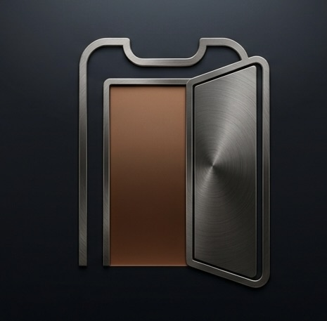
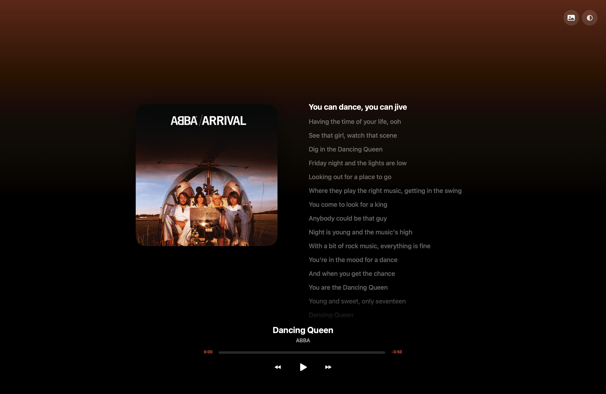
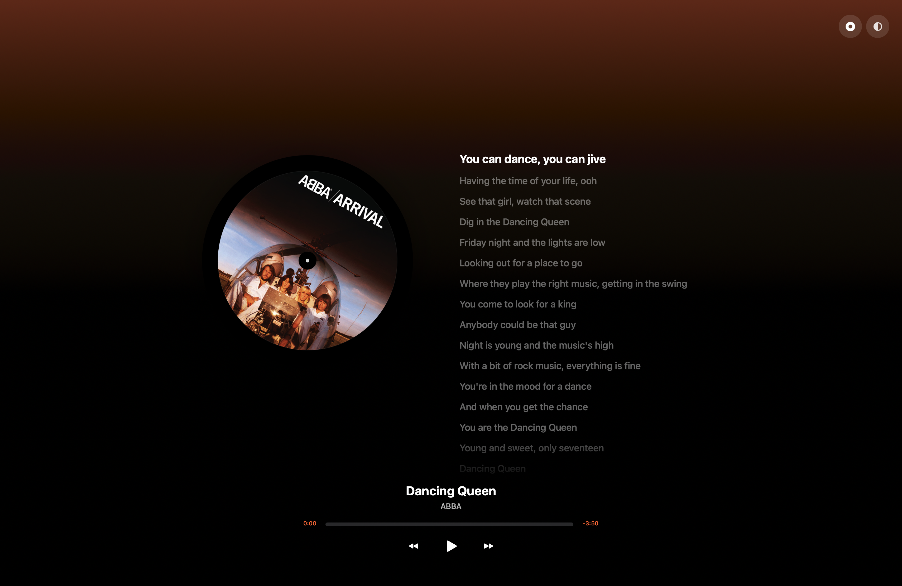

  

<h1 align="center">OpenNotch - DynamicIsland for macOS</h1>

> **This is a personal fork of [Atoll](https://github.com/Ebullioscopic/Atoll)**, renamed to **OpenNotch**. Atoll itself is built on top of [boring.notch](https://github.com/TheBoredTeam/boring.notch). Both upstream projects are licensed under GPL-3.0, and so is this fork — see [License & Attribution](#license--attribution) below for the full chain of credit. All upstream feature/behavior descriptions in this README describe Atoll's original functionality unless noted otherwise.
>
> **What's added on top of Atoll in this fork:**
> - A full-screen lock-screen music overlay (tap the lock-screen media card to open it): large album art in three modes — static cover, Live Canvas video, or a spinning vinyl record (press-and-hold the artwork button, drag down to pick) — with time-synced, tap-to-seek lyrics, a dynamic color background (togglable between full-color and translucent), swipe/tap-to-dismiss, and a standalone global keyboard shortcut to open it from anywhere.
> - A Stocks tab in the notch: pick a stock or ETF (by ticker, name, or ISIN), see a live price chart colored green/red by trend, current price, and daily change.
> - The Screen Assistant repurposed into a local-first Obsidian vault assistant: runs on Ollama (no cloud billing) with Claude as an optional fallback, automatically includes your vault as context, and proposes note edits with a confirm-before-write step.

  
  

The new full-screen lock-screen music overlay — static album art (left) and spinning vinyl mode (right), with time-synced lyrics.

This project stands entirely on the work of the original creators — please consider supporting them:

  
  
  

  <a href="https://discord.gg/PaqFkRTDF8">Join the (upstream Atoll) Discord community</a>

OpenNotch turns the MacBook notch into a focused command surface for media, system insight, and quick utilities. It stays out of the way until needed, then expands with responsive, native SwiftUI animations — plus the full-screen lock-screen overlay, Stocks tab, and Obsidian assistant added in this fork (see above).

  

<!-- TODO: add a screenshot of the new fullscreen lock-screen overlay here once captured -->

## Highlights
- Media controls for Apple Music, Spotify, and more with inline previews.
- Live Activities for media playback, Focus, screen recording, privacy indicators, downloads (beta), and battery/charging.
- Lock screen widgets for media, timers, charging, Bluetooth devices, and weather.
- Lightweight system insight for CPU, GPU, memory, network, and disk usage.
- Productivity tools including timers, clipboard history, color picker, and calendar previews.
- Customization for layouts, animations, hover behavior, and shortcut remapping.

## Other Features
- Gesture controls for opening/closing the notch and media navigation.
- Parallax hover interactions with smooth transitions.
- Lock screen appearance and positioning controls for panels and widgets.

  

## Requirements
- macOS 14.0 or later (optimised for macOS 15+).
- MacBook with a notch (14/16‑inch MBP across Apple silicon generations).
- Xcode 15+ to build from source.
- Permissions as needed: Accessibility, Camera, Calendar, Screen Recording, Music.

## Installation
1) Download the latest release [here](../../releases/latest).
2) Open the archive and drag OpenNotch into Applications.
3) Launch OpenNotch and grant the requested permissions.

*(Everything below this point was written for the upstream Atoll project and largely still applies — feature names like "Atoll" in the text refer to the shared upstream behavior.)*

## Quick Start
- Hover near the notch to expand; click to enter controls.
- Use tabs for Media, Stats, Timers, Clipboard, and more.
- Adjust layout, appearance, and shortcuts from Settings.
- Add files to Shelf from Terminal: `open -a Atoll /path/to/file`.

## Settings
- Choose appearance, animation style, and per‑feature toggles.
- Remap global shortcuts and adjust hover behaviour.
- Enable lock screen widgets and select data sources.

## Gesture Controls
- Two-finger swipe down to open the notch when hover-to-open is disabled; swipe up to close.
- Enable horizontal media gestures in **Settings → General → Gesture control** to turn the music pane into a trackpad for previous/next or ±10 second seeks.
- Pick the gesture skip behaviour (track vs ±10s) independently from the skip button configuration so swipes can scrub while buttons change tracks—or vice versa.
- Horizontal swipes trigger the same haptics and button animations you see in the notch, keeping visual feedback consistent with tap interactions.

## Troubleshooting (Basics)
- After granting Accessibility or Screen Recording, quit and relaunch the app.
- If metrics are empty, enable categories in Settings → Stats.
- Media not responding: verify player is active and Music permission is granted.

## License & Attribution
OpenNotch is a fork of [Atoll](https://github.com/Ebullioscopic/Atoll), which is itself built on [boring.notch](https://github.com/TheBoredTeam/boring.notch). Both are released under the GPL-3.0 License, and so is this fork — see [LICENSE](LICENSE) and [NOTICE](NOTICE) for the full terms and the complete chain of attribution.

## Acknowledgments

Atoll (the base this fork builds on) builds upon the work of several open-source projects and draws inspiration from innovative macOS applications:

- [**Boring.Notch**](https://github.com/TheBoredTeam/boring.notch) - foundational codebase that provided the initial media player integration, AirDrop surface implementation, file dock functionality, and calendar event display. Major architectural patterns and notch interaction models were adapted from this project.

- [**Alcove**](https://tryalcove.com) - primary inspiration for the Minimalistic Mode interface design and the conceptual framework for lock screen widget integration that informed Atoll's compact layout strategy.

- [**Stats**](https://github.com/exelban/stats) - source implementation for CPU temperature monitoring via SMC (System Management Controller) access, frequency sampling through IOReport bindings, and per-core CPU utilisation tracking. The system metrics collection architecture derives from Stats project readers.

- [**Open Meteo**](https://open-meteo.com) - weather apis for the lock screen widgets

- [**SkyLightWindow**](https://github.com/Lakr233/SkyLightWindow) - window rendering for Lock Screen Widgets

- [**rtaudio**](https://github.com/ZephyrCodesStuff/rtaudio) - Live music visualizer using C++ was adapted from this project

- [**SwiftTerm**](https://github.com/migueldeicaza/SwiftTerm) - Terminal tab implementation in the standard mode was adapted from this project

- [**DynamicNotch**](https://github.com/jackson-storm/DynamicNotch) - thanks DynamicNotch for letting us use their battery huds

- Wick - Thanks Nate for allowing us to replicate the iOS like Timer design for the Lock Screen Widget

- [**OpenUsage**](https://github.com/robinebers/openusage) - LLM Usage Tracking features

- [**OpenRouter**](https://openrouter.ai) - API for getting automated model pricing

## Contributors

## Star History

A heartfelt thanks to [TheBoredTeam](https://github.com/TheBoredTeam) for being supportive and being totally awesome — Atoll (and by extension this fork) would not have been possible without boring.notch. Thanks also to [Ebullioscopic](https://github.com/Ebullioscopic) for building Atoll in the first place.

---

  
   
  Backed by
   
  <strong>iOS Development Centre</strong>
   
  Powered by Apple and Infosys
   
  SRM Institute of Science and Technology, Chennai, India

  

  Your support helps fund teaching children software development.

